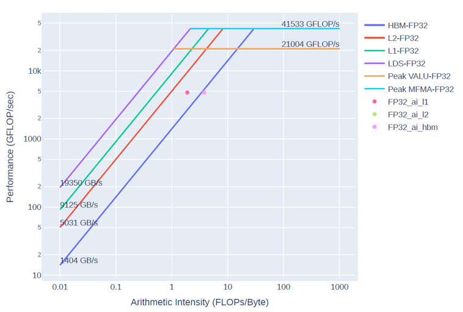

# FLOPS Example

This is a simple example of a kernel that can be modified to use peak GPU memory bandwidth of peak GPU compute.  

## How to use

First, login to the Unison cluster 

```bash
ssh fnsc03@148.225.111.153
```

Then, request a GPU node

```bash
srun -t 5:00:00 --partition=gpu --nodes=1 --gpus=1 --pty bash -i
```

Load necessary modules 

```bash
module load rocm
```

Compile the program and determine the number of iterations.

```bash
make N_ITER=16
```

Run the benchmark 
```bash
./gpu_flops 1000
```


# Using `rocprof-compute`

## Install `rocprof-compute`

First we need to install `rocprof-compute`. We will do this in a 
dedicated conda environment

```bash
module load conda
conda deactivate
conda create -n rocprof-compute python=3.10
conda activate rocprof-compute
```

Now we run the script that download and installs `rocprof-compute`

```bash
cd tools
bash install_rocprof-compute.sh
```

Now we add the binaries to our path

```bash
export PATH=${HOME}/training_unison_2025/tools/rocprof-compute/bin:$PATH
```

## Using `rocprof-compute` to profile our kernel


Run rocprof-compute in profiling mode

```bash
ROCPROF=rocprofv2 rocprof-compute profile -n flops -- ./gpu_flops 100
```

Get the roofline measurement

```bash
ROCPROF=rocprofv2 rocprof-compute profile -n flops --roof-only -- ./gpu_flops 100
```

The output of `rocprof-compute` will be in the `workloads/jacobi/MI210` directory.
There you can see the `empirRoof_gpu-0_FP32.pdf` file which shows the roofline and the performance of your kernel


You should see something like this:



## Using `rocprof-compute` to analyze our kernel


Run rocprof-compute in analysis mode

```bash
rocprof-compute analyze -p workloads/flops/MI210
```

## Change the arithmetic intensity 

The `N_ITER` parameter controls the amount of FLOPs done by the kernel, to increase the arithmetic intensity recompile with a different value for `N_ITER`

```bash
make clean
make N_ITER=256
```

If you get the roofline measurement you will see hor the kernel data point moved to a higher arithmetic intensity

## `rocprof-compute` Documentation

More documentation can be found here [https://rocm.docs.amd.com/projects/rocprofiler-compute/en/latest/how-to/use.html](https://rocm.docs.amd.com/projects/rocprofiler-compute/en/latest/how-to/use.html) 